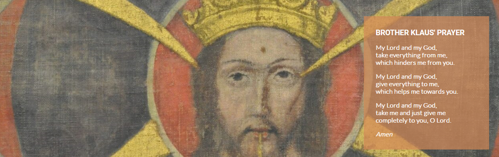
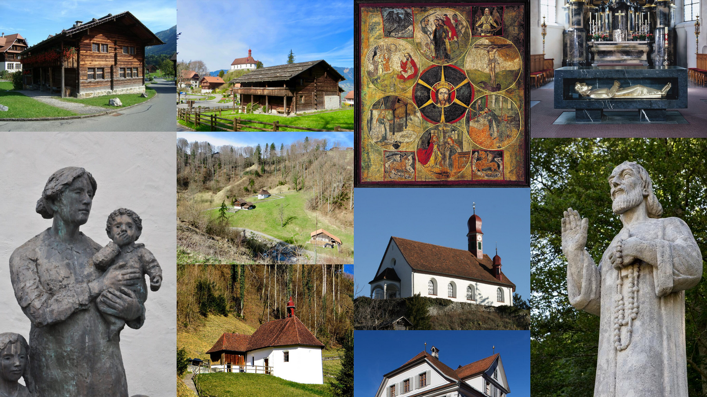

# [Niklaus von Flüe](README.md)

*Niklaus von Flüe* is a website which provides prospective tourists and pilgrims with introductory information and access to resources in connection with the eponymous hermit, hero, and patron saint of Switzerland.

*Niklaus von Flüe* presently comprises:
- outline biographical information about Niklaus von Flüe;
- an English translation of Niklaus von Flüe's well-known prayer;
- a gallery providing impressions of relevant cultural artefacts in the region of Sachseln, Switzerland; and
- a contact form for requesting information and resources about relevant guided tours and pilgims' ways.  

It is planned further to develop the website to integrate into its content promotion of an existing commercial guided tour operator as well as each of the organizations which administer access to relevant heritage places. At the following development stage, it is planned to make the website multilingual. In a later development stage, the website may be extended to support readers by further including a literature list and releted resources.

*Niklaus von Flüe* will serve tourists and pilgrims by providing a central hub for accessing essential information and practical resources. It additionally will benefit an established tour operater as well as relevant foundations, churches, and museums, in each case by informing prospects concerning their respective services.

## Features

This section describes features presently implemented in *Niklaus von Flüe* and outlines planned features which remain to be implemented.

### Existing Features

- __Navigation bar__

  - The fully responsive navigation bar provides links to the Logo, Home page, Gallery and Contact page.
  - To facilitate first-use learning, the navigation bar is implemented in the same form across all pages.
  - For larger screens -- i.e. laptops and larger, implying use of a mouse -- the navigation bar is styled to provide user-feedback in the form of underlining to indicate hover-over in relation to clickable navigation links. 
  - The navigation bar enables the user, across all devices, easily to navigate from page to page without use of the browser ‘back’ button.
  

  

- __Landing page__

  - The landing page commences with an eye-catching detail of Niklaus von Flüh as depicted in the monument to him located in the Sachseln village square.
  - A text overlay inspires user-interest with the evocative subtitle "A Swiss Enigma" and practically assists the user by providing a specific geographical reference to "Sachseln, Obwalden".
  

- __Biography section__

  - The biography section provides the user with a thematically organized summary of Niklaus von Flüh's life, and his unexpected emergence as fifteenth century secular and religious celebrity.
  - The user will be inspired to read further, and to consider making a touristic visit or pilgrimage to Sachseln and Flüeli-Ranft.

- __Meditative prayer section__

  - This section speaks especially to users who are interested in pilgrimage or in pre-renaissance art.
  - It presents --
    - an English translation of Niklaus von Flüh's well-known prayer; and
    - a detail of the religious mandala devised by Niklaus von Flüe to explain his understanding of dynamics associated with an undivided godhead.

- __The Footer__

  - The footer section comprises links to the relevant social media sites in connection with *Niklaus von Flüe*. The links open to a new tab to allow easy navigation for the user. In addition, each link specifies the noopener relationship to protect the website from online attack.
  - The footer is valuable to the user as it encourages them to keep connected via social media in order to be updated in relation to new developments concerning *Niklaus von Flüe*.

- __Gallery__

  - The gallery provides the user with a selection of supporting images showing key places, institutions, buildings, artworks, and monuments.
  - It serves the user by providing visual inspiration to support a decision to use the contact form to request touristic or pilgimage-related resources.

- __Contact page__

  - This page allows the user to request resources from the website operator. The user is requested to specify whether he or she would like to receive resources in relation to guided tours, pilgimage, or both types of activity.
  - The user will be asked to submit his or her full name and email address.
  - The user form uses validation which permits submission of the form only when text is entered in the text inputs, the email address text input contains an "@" symbol, and the radio buttons specify a resource type.

### Features Left to Implement

- __Promotion of partner organizations__

  - This page will allow the user directly to book guided tours offered by the website's tourism partner, in relation to which the website will negotiate a commission.
  - This page additionally will comprise a resources hub providing links to partner foundations, churches and museums.

- __Multilingual support__

  - As interest in pilgrimage currently is increasing in Europe and the European diaspora, it is intended to make the website more broadly accessible by providing multilingual support.
  - The first multilingual implementation will support French, German, and Italian, languages, which are the national languages of Switzerland.
  - A subsequent multilingual implementation might be made to support Portuguese, Russian, and Spanish languages, reflecting nationalities frequently traveling to Switzerland for tourism purposes.
  - A possible further multilingual implementation would be made to support Chinese, Korean, and Japanese languages in an effort to reach out to tourism visitors from East Asia, who increasingly are visiting Switzerland.

- __Literature resources__

  - In a later development stage, the website may be extended to support readers by further including a literature list and copies of scholarly publications which are relatively difficult to access.
  
## Testing

*Niklaus von Flüe* was deployed early in its development to [GitHub](https://michael-lusk-2023.github.io/niklaus-von-fluee/index.html) in order to facilitate third-party testing during and at the conclusion of the development process. Continuous feedback was received from a primary third-party tester. This feedback flowed into and informed testing by the author.

The author conducted testing throughout the development process and at the conclusion of development. In consequence of this testing activity, numerous corrections were made to the code and the content of the website. These corrections are noted up in the project's commit log.

The following website features were tested for proper functionality by accessing the deployed code using two different mobile phones, a tablet, and a large format laptop:
- landing page
- logo link
- navigation bar links
- footer links
- contact form  

All the links function correctly, as do the validation and submit functions of the contact form.

The following issues disclosed by testing remain to be addressed:
- On small mobile phone screens, too little of the hero image on landing page is displayed.
- On small mobile phone screens, the gray-colored div overlaid on the background image extends below the bottom of the background image and the footer.

### Validator testing

- HTML
  - No errors were returned when passing through the official W3C validator for any of:
    -  [Landing page](https://validator.w3.org/nu/?doc=https%3A%2F%2Fmichael-lusk-2023.github.io%2Fniklaus-von-fluee%2Findex.html);
    -  [Gallery page](https://validator.w3.org/nu/?doc=https%3A%2F%2Fmichael-lusk-2023.github.io%2Fniklaus-von-fluee%2Fgallery.html); or
    - [Contact page](https://validator.w3.org/nu/?doc=https%3A%2F%2Fmichael-lusk-2023.github.io%2Fniklaus-von-fluee%2Fcontact.html)
- CSS
  - No errors were found when passing through the official [(Jigsaw) validator](https://jigsaw.w3.org/css-validator/validator?uri=https%3A%2F%2Fmichael-lusk-2023.github.io%2Fniklaus-von-fluee%2Fassets%2Fcss%2Fstyle.css&profile=css3svg&usermedium=all&warning=1&vextwarning=&lang=en)

